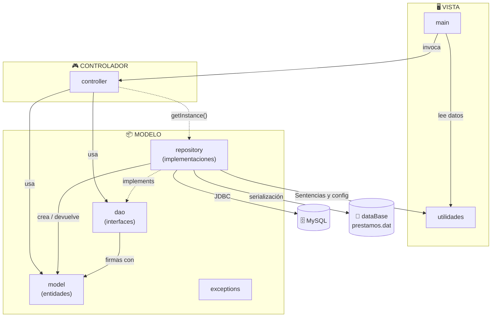

# 📚 Sistema de Gestión de Librería — Grupo 5

Proyecto desarrollado para el módulo de **Acceso a Datos (ADT - Reto 0)** del ciclo de Grado Superior en Desarrollo de Aplicaciones Multiplataforma (**DAM**), en **CIFP Tartanga LHII**.

---

## 📖 Descripción General

El **Sistema de Gestión de Librería** es una aplicación de consola en Java diseñada para administrar el catálogo de libros, los usuarios registrados y las operaciones de préstamos y devoluciones de la librería.

El proyecto destaca por su **arquitectura híbrida de persistencia**:
- **Base de datos relacional (JDBC / MySQL)** para la gestión persistente de **Usuarios** y **Libros**.
- **Fichero binario `.dat` (serialización de objetos Java)** para la gestión de **Préstamos**, con mecanismo automatizado de **Backup & Recovery**.

---

## ✨ Funcionalidades Principales

Menú de la aplicación de consola:

| Opción | Operación | Descripción |
| :---: | :--- | :--- |
| `1` | 📖 **Registrar un libro** | Añade un nuevo libro al catálogo con su título, autor y género (elegido de una lista). Se registra como disponible. |
| `2` | 👤 **Registrar un usuario** | Da de alta usuarios con validación de email (expresión regular) y teléfono (9 dígitos). |
| `3` | 🔄 **Realizar el préstamo** | Muestra los libros disponibles, pide cuántos libros se prestan, valida el usuario (máx. 3 intentos) y reserva los libros indicados. Un mismo préstamo puede incluir varios libros. |
| `4` | 📥 **Devolver un libro** | Busca el préstamo activo del libro por su ID, registra la fecha de devolución y lo marca de nuevo como disponible. |
| `5` | 🔍 **Consultar libros disponibles** | Muestra el catálogo de libros cuyo estado actual sea disponible. |
| `6` | 📜 **Ver historial** | Submenú con dos consultas: **por libro** (préstamos del libro, con usuario y fechas, y apertura de su portada) o **por usuario** (todos sus préstamos con los libros y fechas de devolución). |
| `0` | 🚪 **Salir** | Cierra la aplicación. |

### Detalles de comportamiento

- Si un libro no existe, no está disponible o está repetido dentro del mismo préstamo, se **omite** y el resto del préstamo continúa.
- Si el préstamo no se puede guardar, los libros reservados se **liberan** automáticamente (vuelven a estar disponibles).
- Las devoluciones se registran **por libro** dentro del préstamo: la fecha `null` indica que el libro todavía no ha sido entregado.
- Al consultar el historial de un libro se abre su **imagen de portada** con el visor del sistema (`Desktop`), por lo que requiere entorno gráfico.

---

## 🛠️ Arquitectura y Patrones de Diseño

El proyecto implementa buenas prácticas de desarrollo software con una clara separación de responsabilidades:

- **Modelo-Vista-Controlador (MVC)**: desacoplamiento entre la interacción por consola (`Main.java`, `Util.java`), los controladores de negocio (`LibroController`, `UsuarioController`, `PrestamoController`) y el modelo de datos (`Libro`, `Usuario`, `Prestamo`, `Genero`).
- **DAO (Data Access Object)**: interfaces (`LibroDao`, `UsuarioDao`, `PrestamoDao`) que abstraen el acceso a datos.
- **Patrón Repositorio / Implementación**: clases concretas (`AccesoLibro`, `AccesoUsuario`, `AccesoPrestamo`) que implementan las interfaces DAO usando **JDBC** (libros y usuarios) y **serialización Java** (préstamos). `AccesoDataBase` es la clase base que carga la configuración y proporciona las conexiones JDBC.
- **Patrón Singleton**: instancia única para los repositorios (`AccesoLibro`, `AccesoUsuario`, `AccesoPrestamo`) y para `PrestamoController`, mediante `getInstance()`.
- **Manejo de excepciones personalizadas**: `AccesoDatosException` (errores de acceso a BD o fichero) y `LibroNoEncontradoException` (libro inexistente).
- **Validación de entrada**: `Util` valida el formato de email y teléfono, y el rango de las opciones numéricas, repitiendo la petición hasta obtener un valor correcto.
- **Sentencias SQL centralizadas**: todas las consultas están en la clase `Sentencias` y se ejecutan con `PreparedStatement`.
- **Lista de préstamos en memoria**: `PrestamoController` mantiene la lista cargada y solo la recarga del fichero cuando es necesario (por ejemplo, tras un fallo de guardado).
- **Tolerancia a fallos / Backup automático**:
  - Antes de cada guardado se copia `prestamos.dat` a `prestamos_backup.dat`.
  - La escritura se hace primero en un fichero temporal (`prestamos.tmp`) y después se mueve al definitivo, para no dejar el fichero principal a medias.
  - Si `prestamos.dat` se corrompe o no se puede leer, la aplicación restaura automáticamente la copia de seguridad y reintenta la carga.
  - Si el fichero no existe, se crea vacío al iniciar `PrestamoController`.

---

## 🗄️ Modelo de Datos

### 1. Base de Datos MySQL (`libreriadb`)

```sql
CREATE DATABASE libreriadb;
USE libreriadb;

CREATE TABLE USUARIO (
    ID_USUARIO INT PRIMARY KEY AUTO_INCREMENT,
    NOMBRE VARCHAR(50),
    EMAIL VARCHAR(50),
    TELEFONO VARCHAR(9)
);

CREATE TABLE LIBRO (
    ID_LIBRO INT PRIMARY KEY AUTO_INCREMENT,
    TITULO VARCHAR(50),
    AUTOR VARCHAR(50),
    GENERO ENUM('FANTASIA', 'MISTERIO', 'ROMANCE'),
    DISPONIBLE BOOLEAN,
    RUTA VARCHAR(50)
);
```

> La columna `RUTA` guarda la ruta de la imagen de portada del libro (imágenes en `src/res/`). Los libros insertados desde la aplicación no rellenan este campo; las portadas se asignan en el script `libreriadb.sql`.

### 2. Fichero de préstamos (`prestamos.dat`)

Los préstamos se guardan como una **`List<Prestamo>` serializada** con `ObjectOutputStream` (formato binario, no legible directamente). La clase `Prestamo` implementa `Serializable` y tiene la siguiente estructura:

| Campo | Tipo | Descripción |
| :--- | :--- | :--- |
| `id` | `int` | Identificador del préstamo (se calcula como el máximo existente + 1). |
| `fechaIni` | `LocalDate` | Fecha en la que se realizó el préstamo. |
| `libros` | `Map<Integer, LocalDate>` | Pares `idLibro → fechaFin`. Si `fechaFin` es `null`, el libro sigue prestado. |
| `idUsuario` | `int` | Usuario al que se realizó el préstamo. |

Ejemplo conceptual de un préstamo con dos libros, uno ya devuelto:

```text
Prestamo { id: 1, fechaIni: 2026-09-29, idUsuario: 1,
           libros: { 2 -> 2026-10-05, 4 -> null } }
```

---

## 📂 Estructura del Proyecto

El proyecto sigue el patrón **MVC** separando el código en packages. La comunicación va en un solo sentido: la **Vista** llama al **Controlador**, el **Controlador** trabaja contra las interfaces del **Modelo** y el modelo no conoce a las capas superiores.



> Todos los packages pueden lanzar o capturar las excepciones de `exceptions`, por eso no se dibujan sus flechas.

### 📦 Qué guarda cada package

- **`main`**: `Main.java`, punto de entrada. Muestra los menús, pide los datos y llama a los controladores. No contiene lógica de negocio.
- **`utilidades`**: `Util.java` (lectura y validación de datos por consola), `Sentencias.java` (sentencias SQL) y `configGlobal.properties` (configuración de conexión a MySQL).
- **`controller`**: `LibroController`, `UsuarioController` y `PrestamoController`. Contienen la lógica de negocio: reglas de préstamo y devolución, validación de usuario y libros, y los historiales.
- **`dao`**: `LibroDao`, `UsuarioDao` y `PrestamoDao`. Interfaces que definen qué operaciones de datos existen, sin decir cómo se hacen.
- **`repository`**: `AccesoDataBase` (clase base con las conexiones JDBC), `AccesoLibro` y `AccesoUsuario` (MySQL) y `AccesoPrestamo` (fichero `.dat` con backup). Implementan los DAO.
- **`model`**: `Libro`, `Usuario`, `Prestamo` y el enum `Genero`. Entidades del dominio, sin dependencias de otras capas.
- **`exceptions`**: `AccesoDatosException` y `LibroNoEncontradoException`. Las lanzan los repositorios y las capturan los controladores.
- **`dataBase`**: `prestamos.dat` y `prestamos_backup.dat`, ficheros de persistencia de los préstamos.
- **`res`**: imágenes de portada (`.jpg`) de los libros.

---

## ⚙️ Requisitos e Instalación

### Requisitos Previos

- **JDK 21** o superior.
- **MySQL Server 8.0+**.
- **Apache NetBeans IDE** (o cualquier IDE Java compatible con Ant).
- **MySQL Connector/J** (driver JDBC) añadido a las librerías del proyecto.
- Entorno gráfico disponible (necesario para abrir las portadas de los libros).

### Configuración del Entorno

1. **Clonar el repositorio**:
   ```bash
   git clone https://github.com/tu_usuario/Libreria_Project_G5.git
   ```

2. **Importar la base de datos**:
   Ejecuta el archivo [`libreriadb.sql`](libreriadb.sql) en tu cliente de MySQL (MySQL Workbench, phpMyAdmin o CLI):
   ```bash
   mysql -u root -p < libreriadb.sql
   ```

3. **Configurar las credenciales de MySQL**:
   Modifica el archivo `src/utilidades/configGlobal.properties` con los datos de tu servidor MySQL local:
   ```properties
    Conn=jdbc:mysql://localhost:3306/libreriadb?serverTimezone=Europe/Madrid&useSSL=false&allowPublicKeyRetrieval=true
    DBUser=tu_usuario
    DBPass=tu_contraseña
   ```

4. **Ejecutar la aplicación**:
   - Abre el proyecto `Libreria_Project_G5` en NetBeans.
   - Haz clic secundario en el proyecto y selecciona **Run**, o ejecuta directamente [`Main.java`](Libreria_Project_G5/src/main/Main.java).

> ⚠️ **Importante:** las rutas de los ficheros de préstamos (`./src/dataBase/prestamos.dat`) son relativas, así que la aplicación debe ejecutarse desde la **raíz del proyecto** (como hace NetBeans por defecto).

---

## 👥 Equipo de Desarrollo — Grupo 5

Proyecto realizado por los alumnos del Grupo 5 para el módulo de **Acceso a Datos**:

- 👤 **Christian** https://github.com/FoxyGamer1156
- 👤 **Joel** https://github.com/vitadis
- 👤 **Hodei Torres** https://github.com/HodeiTorres33
- 👤 **An** https://github.com/Azkona05

---